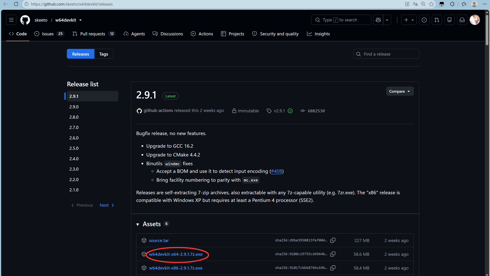
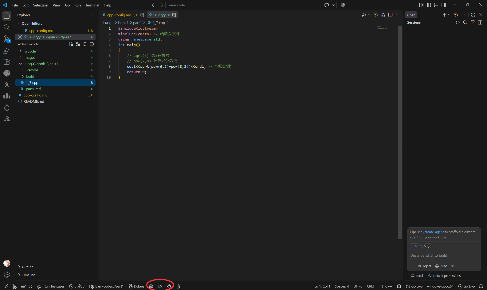

# vscode配置cpp

## 一、配置编译器

下载.exe 文件，双击安装  （[地址]([Releases · skeeto/w64devkit](https://github.com/skeeto/w64devkit/releases))） 记住你的安装路径（安装到哪里了）

找到安装好的`w64devkit`文件夹，双击打开，复制该文件下**`bin`文件夹的路径**，配置**环境变量**：
右键此电脑-属性-高级系统设置-环境变量-系统变量-Path-新建-输入刚刚赋值的路径-然后一路点击确定退出（三个确定）

## 二、安装vscode插件（扩展）

1. C/C++
2. C/C++ Runner

插件安装好后，工作区文件夹中会自动出现`.vscode`文件夹

## 三、编译、运行、调试

下方圈住的三个分别为：编译、运行、调试

点击编译，出现`build`文件夹

也可以选择右上角有下拉选项的按钮，下拉可选择运行或调试代码，会直接生成.exe文件
日常算法学习直接用右上角按钮即可